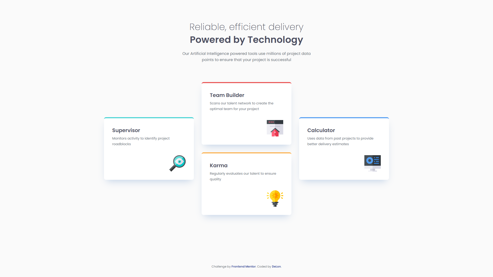

# 📌 Frontend Mentor - Four Card Feature Section Solution


This is a solution to the [Four card feature section challenge on Frontend Mentor](https://www.frontendmentor.io/challenges/four-card-feature-section-weK1eFYK). Frontend Mentor challenges help you improve your coding skills by building realistic projects.

---

## 📋 Table of contents

- [Overview](#overview)
  - [The challenge](#the-challenge)
  - [Preview](#preview)
  - [Links](#links)
- [My process](#my-process)
  - [Built with](#built-with)
  - [What I learned](#what-i-learned)
  - [Continued development](#continued-development)
- [Author](#author)

---

## 🧐 Overview

### The challenge

Users should be able to:

- View the optimal layout for the site depending on their device's screen size
- Experience a fully responsive multi-column layout on tablet and desktop screens

### 📸 Preview



### 🚀 Links

- **Solution URL:** [https://github.com/DeLon-w/four-card-feature-section](https://github.com/DeLon-w/four-card-feature-section)
- **Live Site URL:** [https://delon-w.github.io/four-card-feature-section/](https://delon-w.github.io/four-card-feature-section/)

---

## 🛠️ My process

### Built with

* Semantic HTML5 markup (`main`, `section`, `article`, `header`)
* CSS Custom Properties (Variables)
* CSS Grid (3-column layout with custom row spanning)
* Flexbox layout
* BEM Methodology
* Mobile-First workflow
* Fluid Typography & Spacing (`clamp()`, `rem`, `vw`)

### ✨ What I learned

In this project, I focused on building a fully responsive feature section using a **Mobile-First** approach and modern CSS features like **CSS Grid** and **Fluid Typography**.

Key learnings included:

- **Mobile-First Workflow:** Building the base layout for mobile devices first (single-column stack) and then progressively enhancing it for tablets and desktop screens using `@media` queries.
- **Advanced CSS Grid Positioning:** Utilizing `grid-column` and `grid-row` with `span` to place cards into a multi-column "cross" pattern on desktop screens.
- **Fluid Typography & Dynamic Spacing:** Using the `clamp()` function combined with `vw` and `rem` units to achieve smooth scaling of headings, margins, and paddings across all viewports without sudden breakpoint jumps.
- **Clean Container Sizing:** Implementing `width: min(100% - 2.5rem, 69.375rem)` to ensure safe side gaps on mobile while strictly constraining the maximum container width on larger displays.

```css
/* Dynamic heading size using clamp() */
.features__title {
    font-size: clamp(1.5rem, 1.15rem + 1.5vw, 2.25rem);
    color: var(--gray-500);
}

/* Custom desktop grid layout */
@media (min-width: 69.375rem) {
    .features__grid {
        grid-template-columns: repeat(3, 1fr);
        grid-template-rows: repeat(2, 1fr);
        gap: 1.875rem;
    }

    .features__item:nth-child(1) {
        grid-column: 1;
        grid-row: 1 / span 2;
    }
}
```

### 🚀 Continued development

In future projects, I plan to continue practicing fluid layouts with `clamp()`, explore CSS subgrid features, and deepen my knowledge of web accessibility (WCAG) guidelines.

---

## 🧑‍💻 Author

- **Frontend Mentor:** [@DeLon-w](https://www.frontendmentor.io/profile/DeLon-w)
- **GitHub:** [@DeLon-w](https://github.com/DeLon-w)